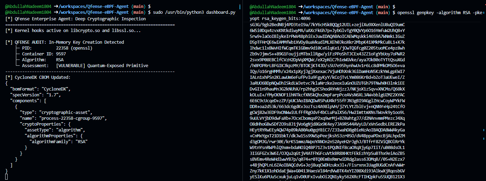
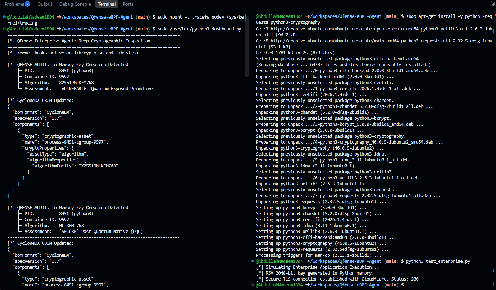

# QFense eBPF Agent 🛡️⚡
> **Dynamic Live-Memory Cryptographic Discovery & Post-Quantum (PQC) Telemetry Engine**

[](https://opensource.org/licenses/MIT)
[](https://ebpf.io/)
[](https://cyclonedx.org/)

QFense eBPF Agent is an enterprise-grade cryptographic observability tool. By leveraging user-space probes (**Uprobes**) and kernel probes (**Kprobes**), QFense hooks directly into live server memory (`libcrypto.so` and `libssl.so`) to intercept cryptographic primitives in real time with near-zero CPU overhead.

It automatically evaluates cryptographic usage against NIST Post-Quantum standards and outputs a dynamic **Cryptographic Bill of Materials (CBOM)** compliant with the CycloneDX 1.7 standard.

---

## 🏛️ Architecture Overview

```text
                    ┌────────────────────────────────────────────────────────┐
                    │                   User-Space Runtime                   │
                    │   (OpenSSL, Python Requests, Nginx, Microservices)     │
                    └───────────┬────────────────────────────────┬───────────┘
                                │                                │
                                ▼ [Uprobe: libcrypto.so]         ▼ [Uprobe: libssl.so]
                       EVP_PKEY_CTX_new_from_name        SSL_set_cipher_list
                                │                                │
                    ┌───────────┴────────────────────────────────┴───────────┐
                    │                      Linux Kernel                      │
                    │                                                        │
                    │  ┌─────────────────────────┐  ┌─────────────────────┐  │
                    │  │ BPF_HASH: Deduplication │  │ Kprobe: tcp_connect │  │
                    │  └────────────┬────────────┘  └──────────┬──────────┘  │
                    │               │                          │             │
                    │               ▼                          ▼             │
                    │        [ BPF Perf Ring Buffer (Kernel-to-User) ]       │
                    └───────────────────────────────┬────────────────────────┘
                                                    │
                                                    ▼
                    ┌────────────────────────────────────────────────────────┐
                    │                  QFense Control Plane                  │
                    │  • PQC Classification (ML-KEM / ML-DSA vs. RSA / ECC)  │
                    │  • Real-Time CycloneDX 1.7 Dynamic CBOM Generator      │
                    │  • Container Attribution (cgroup_id tracking)          │
                    └────────────────────────────────────────────────────────┘
```

## 📸 Live Memory Interception
QFense dynamically catches high-level enterprise application executions directly from CPU registers, bypassing standard static analysis blind spots.



## 📦 Real-Time CycloneDX 1.7 CBOM
Automatically generates post-quantum compliant Cryptographic Bills of Materials on the fly.



---

## ✨ Key Features

* **Live Memory Interception:** Intercepts secret key generation and algorithm context directly from CPU registers before data hits disk.
* **Kernel-Level Deduplication:** Uses O(1) eBPF Hash Maps (`BPF_HASH`) to prevent event storms and maintain low overhead.
* **Post-Quantum Risk Categorization:** Classifies algorithms into Post-Quantum Native (`ML-KEM`, `ML-DSA`) or Quantum-Exposed (`RSA`, `ECDSA`, `X25519`).
* **Dynamic CBOM Generation:** Emits compliant CycloneDX 1.7 JSON payloads containing container IDs, algorithm families, and process attribution.
* **Container & Namespace Aware:** Automatically tags cryptographic operations with kernel `cgroup_id` for microservice isolation.

---

## 🚀 Quickstart

### Prerequisites
* Linux Kernel 5.15+ (with BPF & BTF support)
* `bpfcc-tools`, `python3-bpfcc`, `clang`, `llvm`

### Installation & Run

1. **Clone the Repository:**
   ```bash
   git clone [https://github.com/AbdullahNadeem1804/QFense-eBPF-Agent.git](https://github.com/AbdullahNadeem1804/QFense-eBPF-Agent.git)
   cd QFense-eBPF-Agent
   ```

2. **Mount the Tracing Subsystem:**
   ```bash
   sudo mount -t tracefs nodev /sys/kernel/tracing
   ```

3. **Start the QFense Agent:**
   ```bash
   sudo python3 dashboard.py
   ```

4. **Simulate Workloads (In a separate terminal):**
   ```bash
   # Test Legacy RSA Keygen
   openssl genpkey -algorithm RSA -pkeyopt rsa_keygen_bits:2048

   # Test Post-Quantum Hybrid TLS Handshake
   openssl s_client -connect 1.1.1.1:443 -quiet
   ```

---

## 📋 Sample Dynamic CBOM Output

```json
{
  "bomFormat": "CycloneDX",
  "specVersion": "1.7",
  "components": [
    {
      "type": "cryptographic-asset",
      "name": "process-28329-cgroup-8310",
      "cryptoProperties": {
        "assetType": "algorithm",
        "algorithmProperties": {
          "algorithmFamily": "RSA",
          "keyLength": 2048
        }
      }
    }
  ]
}
```

---

## 🗺️ Roadmap
- [x] eBPF Uprobes on OpenSSL 3.0 (`libcrypto.so`)
- [x] Kernel-space deduplication via `BPF_HASH`
- [x] CycloneDX 1.7 CBOM Real-Time Generation
- [ ] CO-RE (Compile Once – Run Everywhere) migration via `libbpf`
- [ ] Kubernetes DaemonSet deployment Helm chart
- [ ] Envoy and GnuTLS memory hook support

## 📄 License
This project is licensed under the MIT License - see the [LICENSE](LICENSE) file for details.
